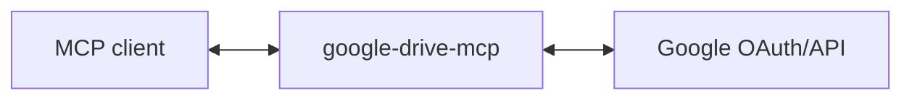

# google-drive-mcp

MCP server for Google Drive - list, search, upload, download, and manage files and folders.

## Use Cases

**Answer from files**: "What was our revenue target in the Q2 board deck?" → searches Drive, reads the relevant doc, and answers your question.

**Project scaffolding**: Starting a new vendor onboarding → creates a folder structure with subfolders for contracts, compliance, deliverables, and meeting notes, plus template docs and sheets.

**Feedback synthesis**: "Summarize the feedback from my manager across my last 10 presentation decks" → reads comments from multiple files and identifies themes and development areas.

**Localization workflow**: "We're onboarding contractors in Japan - translate the onboarding folder from English to Japanese and flag anything that needs local adaptation (HR policies, holidays, etc.)" → reads multiple docs, translates, and highlights areas needing review.

(These are just examples - any workflow that needs file search, reading, or organization can use this. Use in combination with [google-docs-mcp](https://github.com/domdomegg/google-docs-mcp) for reading/editing Google Docs, or [google-sheets-mcp](https://github.com/domdomegg/google-sheets-mcp) for Google Sheets.)

## Setup

### 1. Create Google OAuth credentials

1. Go to [Google Cloud Console](https://console.cloud.google.com/)
2. Create a new project (or use existing)
3. Enable the Google Drive API
4. Go to **APIs & Services** → **OAuth consent screen**, set up consent screen
5. Go to **APIs & Services** → **Credentials** → **Create Credentials** → **OAuth client ID**
6. Choose **Web application**
7. Add `http://localhost:3000/callback` to **Authorized redirect URIs**
8. Note your Client ID and Client Secret

### 2. Run the server

```bash
GOOGLE_CLIENT_ID='your-client-id' \
GOOGLE_CLIENT_SECRET='your-client-secret' \
MCP_TRANSPORT=http \
npm start
```

The server runs on `http://localhost:3000` by default. Change with `PORT=3001`.

### 3. Add to your MCP client

```bash
claude mcp add --transport http google-drive-mcp http://localhost:3000/mcp
```

## Architecture

This server acts as an **OAuth proxy** to Google:



1. Server advertises itself as an OAuth authorization server via `/.well-known/oauth-authorization-server`
2. `/register` returns the Google OAuth client credentials
3. `/authorize` redirects to Google, encoding the client's callback URL in state
4. `/callback` receives the code from Google and forwards to the client's callback
5. `/token` proxies token requests to Google, injecting client credentials
6. `/mcp` handles MCP requests, using the bearer token to call Drive API

The server holds no tokens or state - it just proxies OAuth to Google.

## Tools

| Tool | Description |
|------|-------------|
| **Files** | |
| `files_list` | List/search files using Drive query syntax |
| `file_get` | Get file metadata |
| `file_download` | Download file content (supports export for Google Docs/Sheets) |
| `file_upload` | Upload a new file |
| `file_update` | Update file content or metadata |
| `file_copy` | Copy a file |
| `file_move` | Move a file to a different folder |
| `file_trash` | Move to trash |
| `file_untrash` | Restore from trash |
| `file_delete` | Permanently delete |
| **Folders** | |
| `folder_create` | Create a new folder |
| **Comments** | |
| `comments_list` | List comments on a file |
| `comment_get` | Get a comment and its replies |
| `comment_create` | Add a comment to a file |
| `comment_reply` | Reply to a comment |
| `comment_resolve` | Resolve or unresolve a comment |
| **Replies** | |
| `replies_list` | List replies to a comment |
| `reply_get` | Get a specific reply |
| `reply_update` | Update a reply |
| `reply_delete` | Delete a reply |
| **Permissions** | |
| `permissions_list` | List who has access to a file |
| `permission_get` | Get a specific permission |
| `permission_create` | Share a file with a user, group, domain, or anyone |
| `permission_update` | Change a user's access level |
| `permission_delete` | Revoke access to a file |

## Drive Query Syntax

The `files_list` tool supports Drive's query syntax for filtering:

```
# By name
name contains 'report'
name = 'Budget 2024'

# By type
mimeType = 'application/pdf'
mimeType = 'application/vnd.google-apps.folder'
mimeType = 'application/vnd.google-apps.document'

# By folder
'folder-id' in parents

# By ownership
'user@example.com' in owners

# Combined
name contains 'report' and mimeType = 'application/pdf'
```

## Google Drive API Scopes

- `drive` - Full access to Drive files

## Contributing

Pull requests are welcomed on GitHub! To get started:

1. Install Git and Node.js
2. Clone the repository
3. Install dependencies with `npm install`
4. Run `npm run test` to run tests
5. Build with `npm run build`

## Releases

Versions follow the [semantic versioning spec](https://semver.org/).

To release:

1. Use `npm version <major | minor | patch>` to bump the version
2. Run `git push --follow-tags` to push with tags
3. Wait for GitHub Actions to publish to the NPM registry.

## Azure Container App Deployment

Deploy this server as a publicly accessible HTTPS endpoint on [Azure Container Apps](https://azure.microsoft.com/en-us/products/container-apps) so it can be registered as a custom connector in claude.ai.

### Prerequisites

- [Azure CLI](https://learn.microsoft.com/en-us/cli/azure/install-azure-cli) (`az`) installed and up to date
- [Docker](https://docs.docker.com/get-docker/) installed (used locally only if you build manually; `az acr build` builds in the cloud)
- Node.js 20+ (for local development; not required for deployment itself)
- An active Azure subscription
- Google OAuth credentials — see [Setup](#setup) above for how to create them

### Steps

#### 1. Log in to Azure

```bash
az login
az account set --subscription "<your-subscription-id>"
```

#### 2. Configure credentials

Export your Google OAuth credentials as environment variables:

```bash
export GOOGLE_CLIENT_ID='your-google-client-id'
export GOOGLE_CLIENT_SECRET='your-google-client-secret'
```

Optionally customise the deployment:

```bash
export APP_NAME='gdrive-mcp'      # base name for all Azure resources
export LOCATION='canadaeast'      # Azure region (canadaeast recommended for Quebec)
```

#### 3. Run the deployment script

```bash
chmod +x azure/deploy.sh
./azure/deploy.sh
```

The script performs four steps automatically:

1. **Provision** — deploys a Resource Group, Log Analytics Workspace, Container App Environment, Azure Container Registry (Basic), and a Container App via `azure/main.bicep`.
2. **Build & push** — builds the Docker image in the cloud using `az acr build` and pushes it to the provisioned ACR.
3. **Update** — updates the Container App to use the newly pushed image.
4. **Report** — prints the final HTTPS URL.

#### 4. Note the endpoint URL

At the end of the script you will see something like:

```
MCP endpoint : https://gdrive-mcp.bluefield-12345678.canadaeast.azurecontainerapps.io/mcp
```

#### 5. Register as a custom connector in claude.ai

1. Open **claude.ai** → click your profile → **Settings**
2. Go to **Customize** → **Connectors**
3. Click **Add custom connector**
4. Paste the MCP endpoint URL (e.g. `https://<fqdn>/mcp`)
5. Save

#### 6. First-time OAuth flow

Because the Container App scales to zero when idle, the first request after a cold start takes a few seconds. On the very first use, claude.ai will redirect you through a Google OAuth consent screen to authorise access to your Drive. After that, the token is managed automatically by the client.

### Infrastructure overview

| Resource | Name pattern | Notes |
|---|---|---|
| Resource Group | `<appName>-rg` | All resources live here |
| Log Analytics | `<appName>-logs` | 30-day retention |
| Container App Env | `<appName>-env` | Shared environment |
| Container Registry | `<appName>acr` | Basic SKU, admin enabled |
| Container App | `<appName>` | 0–1 replicas, 0.25 vCPU / 0.5 GiB |

### Customising parameters

Edit `azure/parameters.bicepparam` to change defaults before running the script, or pass values directly via environment variables as shown above.
